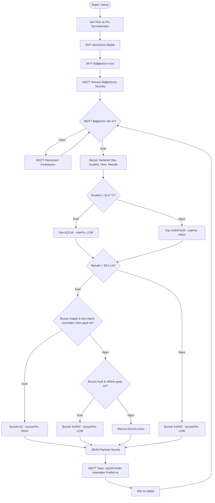

# Akıllı Kompostlama Sistemi - Proje Tasarımı

Bu belge, **Akıllı Kompostlama Sistemi** projesinin sistem mimarisini, donanım bileşenlerini, yazılım akış şemalarını ve deneysel tasarım detaylarını içerir.

---

## 1. Sistem Mimarisi ve Donanım Tasarımı

Sistem, organik atıkların kompostlaşma sürecini optimize etmek amacıyla sıcaklık, nem ve doluluk (mesafe) oranlarını izleyen ve kontrol eden IoT tabanlı bir otomasyon sistemidir.

### 1.1. Donanım Bileşenleri ve Bağlantı Şeması

Projede kullanılan donanım bileşenleri ve ESP32 mikrokontrolcü kartı üzerindeki pin eşleşmeleri aşağıdaki gibidir:

| Bileşen | Görevi | ESP32 Pin Numarası | Çalışma Modu / Tipi |
| :--- | :--- | :---: | :--- |
| **ESP32 NodeMCU** | Ana Kontrolcü / Wi-Fi & MQTT Bağlantısı | - | Ana İşlemci |
| **DHT11 / DHT22** | Sıcaklık ve Nem Sensörü | `GPIO 4` | Giriş (Digital) |
| **HC-SR04** | Ultrasonik Mesafe Sensörü (Doluluk Ölçümü) | `Trig: GPIO 5`   `Echo: GPIO 18` | Çıkış (Trigger)   Giriş (Echo) |
| **Röle Modülü & Fan** | Sıcaklık Kontrolü ve Havalandırma | `GPIO 17` | Çıkış (Aktif LOW) |
| **Buzzer** | Doluluk / Limit Aşımı Uyarı Sistemi | `GPIO 16` | Çıkış (Digital) |
| **LDR Sensör** | Işık Seviyesi Ölçümü (Deney Aşamasında) | `GPIO 34` | Giriş (Analog) |

### 1.2. Donanım Özellikleri ve Eşik Değerler

*   **Sıcaklık Eşiği (Fan Kontrolü):** Kompost içerisindeki sıcaklığın **31.0 °C** değerinin üzerine çıkması durumunda fan otomatik olarak devreye girer (`rolePin = LOW`). Sıcaklık bu değerin altına düştüğünde fan kapatılır (`rolePin = HIGH`).
*   **Doluluk Eşiği (Buzzer Alarmı):** Kompost kutusundaki doluluk seviyesi kritik sınıra ulaştığında (ölçülen mesafe **< 30.0 cm** olduğunda), buzzer **10 saniyede bir 300 ms süreyle** kesikli uyarı sesi verir. Mesafe 30.0 cm ve üzerinde ise alarm çalmaz.
*   **Veri Yayınlama (MQTT):** Sensörlerden okunan tüm veriler (sıcaklık, nem, mesafe) JSON formatında paketlenerek **500 ms** aralıklarla MQTT sunucusuna gönderilir.

---

## 2. Yazılım Akış Şeması (Flowchart)

Sistemin çalışma mantığı iki ana aşamadan oluşmaktadır: **Kurulum (Setup)** ve **Ana Döngü (Loop)**.

### 2.1. Mermaid Akış Diyagramı

Sistemin kontrol algoritması aşağıdaki akış şemasında gösterilmiştir:

### 2.2. Görsel Akış Şeması
Projenin görsel tasarım şemasına ve detaylı akış diyagramına [flowChart.png](file:///c:/Users/hp/Desktop/staj%201/Akıllı-Kompostlama-Sistemi/docs/flowChart.png) dosyasından ulaşabilirsiniz.

---

## 3. Deneysel Kurulum ve Analiz

Sistem geliştirilmeden önce, farklı ortamların çevresel parametrelerini incelemek amacıyla kapsamlı bir ön çalışma yapılmıştır.

### 3.1. Deneyin Amacı ve Metodolojisi
Farklı ortamlardaki sıcaklık, nem ve ışık (LDR) değerlerini ölçerek çevresel değişimlerin kompostlama süreci üzerindeki olası etkilerini analiz etmek hedeflenmiştir. 

### 3.2. Test Edilen Ortamlar
*   **Banyo:** Yüksek nem ve değişken sıcaklık koşulları.
*   **Saksı:** Orta düzeyde nem, sulama sıklığına bağlı değişimler ve güneş ışığı.
*   **Buzdolabı:** Sabit düşük sıcaklık (~4°C), minimum nem dalgalanması ve karanlık ortam.
*   **Klimalı Oda:** Kontrol altında tutulan sıcaklık (24-26°C) ve düşük nem seviyeleri.
*   **Klimasız Oda:** Doğal sıcaklık dalgalanmaları ve orta-yüksek nem.
*   **Güneş Işığı Altı:** Yüksek sıcaklık (35°C'ye kadar) ve en yüksek LDR ışık yoğunluğu.
*   **Yapay Işık Altı:** Sabit ışık yoğunluğu ve stabil çevresel koşullar.

### 3.3. Çift Bilgisayar Testi ve Kalibrasyon
Ölçüm tutarlılığını test etmek amacıyla aynı ortamda **iki farklı bilgisayar** üzerinden veri toplama işlemleri gerçekleştirilmiştir. Toplanan veriler arasındaki hafif farklılıklar incelenmiş ve sensör hassasiyeti / kalibrasyon durumları değerlendirilmiştir.

### 3.4. Verilerin Toplanması ve Analiz Edilmesi
*   **Veri Toplama:** `readHumidityTemperature.ino` kodu kullanılarak her 36 saniyede bir ölçüm yapılmış ve toplam 50 veri paketi `test.mosquitto.org` broker'ı aracılığıyla toplanarak metin dosyalarına kaydedilmiştir (Örn: `src/deney/deneySonuclar/output*.txt`).
*   **İstatiksel Analiz:** Toplanan veriler **Jamovi** programına aktarılarak sıcaklık, nem ve ışık yoğunluğu arasındaki korelasyon analizleri yapılmıştır. Bu sayede kompostlama sürecine uygun ideal ortam parametreleri doğrulanmıştır.
